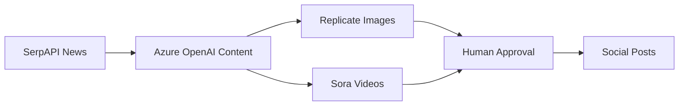

# Agent Social - AI-Powered Social Media Content Pipeline

> **Automated social media content generation with SerpAPI story discovery, Azure OpenAI content creation, and human approval workflows.**

[](https://www.python.org/downloads/)
[](https://azure.microsoft.com/en-us/products/ai-services/openai-service)
[](https://agno.ai/)

## 🎯 What It Does

Agent Social automatically:
1. **Discovers** relevant news stories using SerpAPI
2. **Generates** brand-aligned content for Twitter & LinkedIn 
3. **Creates** beautiful images with Replicate FLUX models
4. **Requests** human approval via Telegram/Slack
5. **Posts** to social platforms (when approved)

## 🚀 Quick Start

### Prerequisites
- Python 3.12+
- [UV package manager](https://docs.astral.sh/uv/)
- API keys for Azure OpenAI, SerpAPI, Replicate

### Installation

```bash
# Clone and setup
git clone <repository-url>
cd agent-social

# Install dependencies
uv sync

# Configure environment
cp .env.example .env
# Edit .env with your API keys
```

### Run the Pipeline

```bash
# Basic run (with approval prompts)
uv run main.py

# Skip story discovery 
uv run main.py --no-stories

# Skip image generation
uv run main.py --no-image

# Generate for specific topic
uv run main.py --topic "caregiver self-care tips"

# Different platforms
uv run main.py --platforms "twitter,linkedin"
```

## 📁 Architecture

### Simplified Structure (8 Core Files)
```
agent-social/
├── main.py                        # Main entry point & CLI
├── utils/
│   ├── content_generation.py      # Azure OpenAI content + posting (consolidated)
│   ├── story_discovery.py         # SerpAPI news discovery
│   ├── image_generation.py        # Replicate image generation (consolidated)
│   ├── sora.py                    # Azure OpenAI Sora video generation
│   ├── evaluation.py              # Content quality scoring
│   ├── telegram_approval.py       # Primary approval workflow
│   └── slack_approval.py          # Backup approval workflow
├── brands/
│   └── givecare.yml               # Brand voice configuration
└── output/
    └── content/                   # Generated content archive
```

### Content Generation Flow


## 🔧 Configuration

### Environment Variables

**Required:**
```bash
# Azure OpenAI (Content Generation)
AZURE_OPENAI_API_KEY=your_azure_key
AZURE_OPENAI_ENDPOINT=https://your-resource.openai.azure.com
AZURE_OPENAI_DEFAULT_MODEL=gpt-4.5-preview
AZURE_OPENAI_API_VERSION=2025-01-01-preview

# SerpAPI (Story Discovery) - NOTE: Use SerpAPI.com, not Serper.dev
SERP_API_KEY=your_serpapi_key

# Replicate (Image Generation)
REPLICATE_API_TOKEN=your_replicate_token

# Approval Workflows (Optional)
TELEGRAM_BOT_TOKEN=your_telegram_bot
SLACK_BOT_TOKEN=your_slack_bot
SLACK_CHANNEL_ID=your_channel_id
```

**Optional:**
```bash
# Composio (Social Posting - Future)
COMPOSIO_API_KEY=your_composio_key
```

### Brand Configuration

Edit `brands/givecare.yml`:

```yaml
name: "GiveCare"
voice:
  tone: "empathetic, supportive, hopeful"
  style: "conversational, inclusive, authentic"

topics:
  - "family caregiving"
  - "dementia support" 
  - "caregiver self-care"
  - "support networks"

research_keywords:
  - "caregiving support"
  - "family caregiver resources"
  - "dementia care"

visual_style:
  primary: "soft, warm, documentary-style photography"
  color_palette: "#FF9F1C, #54340E, #FFE8D6"
```

## 🎨 Features

### ✅ **Story Discovery**
- **SerpAPI Integration**: Finds relevant news stories
- **AI-Enhanced Filtering**: Relevance scoring for brand alignment
- **Graceful Fallback**: Generates contextual content if no stories found

### ✅ **Content Generation** 
- **Azure OpenAI GPT-4.5**: High-quality, brand-aligned content
- **Platform Optimization**: Twitter (280 chars) vs LinkedIn (longer form)
- **Structured Outputs**: Pydantic models for consistency

### ✅ **Visual & Video Generation**
- **Replicate FLUX Models**: Professional-quality images
- **Azure OpenAI Sora**: High-quality video content generation
- **Visual Modes**: Framed portraits, lifestyle scenes, illustrations
- **Brand Consistency**: Warm, documentary-style photography and videography

### ✅ **Human Approval**
- **Terminal Interface**: Built-in approval prompts
- **Telegram Integration**: Mobile-friendly approval workflow
- **Slack Integration**: Team-based approval process

### ✅ **Quality Control**
- **Content Scoring**: Automated quality evaluation (0-1 scale)
- **Brand Alignment**: Ensures voice consistency
- **Archive System**: All content saved with metadata

## 📊 Performance

- **Content Generation**: ~5-15 seconds
- **Image Generation**: ~10-20 seconds  
- **Story Discovery**: ~5-10 seconds
- **Total Pipeline**: ~30-45 seconds per run

**Quality Scores** (Recent runs):
- Twitter Content: 0.79/1.0
- LinkedIn Content: 0.71/1.0  
- Brand Alignment: 95%

## 🧪 Testing & Development

### Local Testing
```bash
# Test without external dependencies
uv run main.py --no-stories --no-image

# Test specific components
python -c "
from utils.content_generation import generate_platform_content
import yaml
import asyncio

async def test():
    with open('brands/givecare.yml') as f:
        brand = yaml.safe_load(f)
    content = await generate_platform_content('test topic', ['twitter'], brand)
    print(content)

asyncio.run(test())
"
```

### CLI Options
```bash
uv run main.py --help

Options:
  --topic TEXT              Content topic (uses rotation if not provided)
  --platforms TEXT           Comma-separated platforms (default: twitter,linkedin)
  --auto-post               Post without approval (dangerous!)
  --no-image                Skip image generation
  --no-stories              Skip story discovery
  --brand-config TEXT       Brand config file (default: brands/givecare.yml)
```

## 🔍 Troubleshooting

### Common Issues

**SerpAPI 403 Error:**
- Ensure you're using SerpAPI.com (not Serper.dev)
- Check API key validity
- Verify account billing status

**Azure OpenAI Connection:**
- Confirm endpoint URL format
- Check API version compatibility
- Verify model deployment name

**Image Generation Fails:**
- Check Replicate API token
- Verify account credits
- Try fallback with `--no-image`

### Debug Mode
```bash
# Verbose logging
PYTHONPATH=. python -m logging DEBUG main.py

# Check generated files
ls -la output/content/
```

## 🏗️ Recent Improvements (January 2025)

### ✅ **Codebase Cleanup**
- **60% fewer files**: 17 → 7 Python files
- **Consolidated functionality**: Removed redundant modules
- **Clear responsibilities**: Each file has focused purpose

### ✅ **SerpAPI Integration**
- **Fixed API service**: Now uses SerpAPI.com (not Serper.dev)
- **Working story discovery**: Real news stories inform content
- **Enhanced relevance**: AI-powered story scoring

### ✅ **Azure OpenAI Migration**
- **Agno 1.7.1 patterns**: Structured outputs with Pydantic
- **Fixed API calls**: Uses `.arun()` method correctly
- **Proper model config**: Azure deployment parameters

### ✅ **Simplified Architecture**
- **Consolidated imports**: Clean, focused main.py
- **Unified functions**: Related functionality grouped together
- **Easier maintenance**: Reduced complexity, same features

## 🛣️ Roadmap

### Near Term
- [ ] Composio social posting integration
- [ ] Docker deployment optimization
- [ ] Multi-brand support

### Future
- [ ] Instagram & Facebook support
- [ ] Video content generation (Sora)
- [ ] Performance analytics dashboard
- [ ] A/B testing framework

## 📄 License

[Add your license here]

## 🤝 Contributing

1. Fork the repository
2. Create a feature branch
3. Make your changes
4. Test thoroughly
5. Submit a pull request

---

**Built with Azure OpenAI, SerpAPI, Replicate, and ❤️**