# Agent Social - Brand-Agnostic AI Content Pipeline

> **Complete brand-aware content generation pipeline with AI-powered evaluation, visual creation, and multi-platform optimization.**

[](https://www.python.org/downloads/)
[](https://azure.microsoft.com/en-us/products/ai-services/openai-service)
[](https://github.com/haizelabs/verdict)

## 🎯 What It Does

Agent Social is a **complete brand-agnostic pipeline** that automatically:

1. **Generates** brand-aligned content for any platform (Twitter, LinkedIn, etc.)
2. **Creates** brand-aware visual content with FLUX models
3. **Evaluates** quality using AI-powered Verdict framework
4. **Adapts** to any brand by changing YAML configuration
5. **Scales** from single posts to enterprise content strategies

## ✨ Key Features

### 🎨 **Brand-Agnostic Architecture**
- **Any Brand**: Switch brands by changing YAML file
- **No Hardcoding**: All styling from configuration
- **Visual Modes**: Configurable image styles per brand
- **Voice Consistency**: AI ensures brand alignment

### 🤖 **AI-Powered Evaluation** 
- **Verdict Framework**: Real LLM-as-a-judge assessment
- **Brand Scoring**: 1-5 scale evaluation with detailed feedback
- **Quality Control**: Automatic content improvement loops
- **Performance Tracking**: Detailed evaluation metrics

### 🖼️ **Visual Content Generation**
- **Brand-Aware Images**: FLUX models with brand styling
- **Negative Prompts**: Avoid off-brand visual elements  
- **Technical Specs**: Configurable photography requirements
- **Visual Harmony**: Text and image alignment

### 📱 **Multi-Platform Optimization**
- **Platform Adaptation**: Twitter vs LinkedIn content styles
- **Character Limits**: Automatic length optimization
- **Hashtag Strategy**: Brand-appropriate hashtag generation
- **Engagement Features**: Platform-specific call-to-actions

## 🚀 Quick Start

### Prerequisites
- Python 3.12+
- [UV package manager](https://docs.astral.sh/uv/)
- API keys for Azure OpenAI, Replicate

### Installation

```bash
# Clone and setup
git clone <repository-url>
cd agent-social

# Install dependencies
uv sync

# Configure environment
cp .env.example .env
# Edit .env with your API keys
```

### Generate Content

```bash
# Basic generation
uv run main.py --topic "your topic here"

# Specific platform
uv run main.py --topic "caregiver wellness" --platforms twitter

# Skip components for testing
uv run main.py --no-stories --no-image

# Different brand (future)
uv run main.py --brand-config brands/other-brand.yml
```

## 📁 Architecture

### Clean Modular Structure
```
agent-social/
├── brands/
│   └── givecare.yml               # Brand configuration
├── pipeline/
│   ├── content/                   # Text generation
│   │   ├── content_generation.py  # Azure OpenAI content creation
│   │   └── intelligent_regeneration.py # Quality improvement loops
│   ├── media/                     # Visual generation  
│   │   ├── image_generation.py    # Brand-agnostic image creation
│   │   └── sora.py                # Brand-agnostic video generation
│   └── evaluation/                # Quality assessment
│       └── evaluation.py          # Verdict AI evaluation system
├── social/                        # Platform posting
│   ├── unified_social.py          # Multi-platform posting
│   ├── linkedin_social.py         # LinkedIn direct API
│   └── x_social.py                # Twitter/X direct API
├── output/content/                # Generated examples
└── main.py                        # CLI entry point
```

### Pipeline Flow

```mermaid
flowchart TD
    A[Topic Input] --> B[Load Brand Config]
    B --> C[Content Generation]
    C --> D[Azure OpenAI GPT-4.5]
    D --> E[Platform Optimization]
    E --> F[Visual Prompt Creation]
    F --> G[Image Generation]
    G --> H[Replicate FLUX]
    H --> I[Brand Styling Applied]
    I --> J[Verdict Evaluation]
    J --> K[Azure OpenAI o4-mini Judge]
    K --> L{Score >= 4.0?}
    L -->|Yes| M[✅ High Quality Content]
    L -->|No| N[🔄 Regenerate & Improve]
    N --> C
    M --> O[Save Results]
    
    style A fill:#e1f5fe
    style M fill:#c8e6c9
    style N fill:#ffcdd2
    style K fill:#fff3e0
```



## 🔧 Configuration

### Environment Variables

**Required:**
```bash
# Azure OpenAI (Content Generation & Evaluation)
AZURE_OPENAI_API_KEY=your_azure_key
AZURE_OPENAI_ENDPOINT=https://your-resource.openai.azure.com
AZURE_OPENAI_DEFAULT_MODEL=gpt-4.5-preview
AZURE_OPENAI_O4_MINI_DEPLOYMENT=o4-mini
AZURE_OPENAI_API_VERSION=2025-01-01-preview

# Replicate (Image Generation)
REPLICATE_API_TOKEN=your_replicate_token

# Optional: Story Discovery
SERP_API_KEY=your_serpapi_key
```

### Brand Configuration

Create or edit `brands/your-brand.yml`:

```yaml
name: "YourBrand"
voice:
  tone: "Professional, approachable, authentic"
  style: "Conversational, clear, jargon-free"
  attributes: ["helpful", "trustworthy", "innovative"]

visual_style:
  core:
    palette:
      primary: "#1E88E5"
      secondary: "#FFC107" 
      accent: "#4CAF50"
    emotion: "confident, optimistic, reliable"
    tone: "modern, clean, professional"
    avoid:
      - "cliché stock photography"
      - "overly staged scenarios"
      - "corporate headshots"

  visual_modes:
    - name: "professional_portrait"
      description: "Clean, modern professional imagery"
      technique: "contemporary photography"
      lighting: "natural, well-lit"
      composition: "balanced, focused"
      suggested_usage: ["social posts", "announcements"]

content_units:
  technical_specs:
    image:
      - "High resolution photography"
      - "Natural lighting preferred"
      - "Authentic expressions and moments"
    video:
      - "Professional video quality"
      - "Smooth camera movements"
      - "Clear audio"
  
  media_rules:
    image_negative_prompts:
      - "generic stock photos"
      - "artificial staging"
    video_negative_prompts:
      - "corporate training style"
      - "dramatic music"

platforms:
  twitter:
    max_chars: 280
    hashtag_limit: 3
    content_template: |
      {core_message}
      
      {key_points_brief}
      
      {hashtags}
  
  linkedin:
    max_chars: 3000
    hashtag_limit: 5
    professional_tone: true
    content_template: |
      💡 {core_message}
      
      {expanded_story}
      
      Key insights:
      {key_points_detailed}
      
      What's your experience? Share below.
      
      {hashtags}

topics:
  - "Your key topic 1"
  - "Your key topic 2"
  - "Your key topic 3"
```

## 📊 Evaluation System

### Verdict AI Scoring

The pipeline uses **Verdict AI framework** for intelligent content evaluation:

**Perfect Brand Alignment (5.0/5):**
```
Caregivers, you don't have to go it alone. Creating a support network can provide emotional strength and practical tips from those who've been there. Reach out and connect today. 💚 #CaregiverSupport #CommunityMatters
```

**Poor Brand Alignment (1.0/5):**
```
🚀 MAXIMIZE your healthcare ROI with our REVOLUTIONARY AI platform! 💰 Get 50% OFF now! Limited time offer! CLICK HERE to transform your business TODAY!
```

### Evaluation Criteria
- **Brand Voice Match**: Does content sound like your brand?
- **Topic Relevance**: Is content on-brand topically?
- **Platform Optimization**: Proper length, format, hashtags?
- **Engagement Quality**: Will audience engage with this?
- **Authenticity**: Does it feel genuine and human?

## 🎯 Usage Examples

### Basic Content Generation
```bash
# Generate Twitter content about your topic
uv run main.py --topic "sustainable business practices" --platforms twitter

# Generate LinkedIn content with image
uv run main.py --topic "remote work productivity" --platforms linkedin
```

### Testing & Development
```bash
# Test content generation only
uv run main.py --topic "test topic" --no-stories --no-image

# Test evaluation system
python -c "
import asyncio
import yaml
from pipeline.evaluation.evaluation import SocialContentJudge

async def test():
    with open('brands/givecare.yml') as f:
        brand = yaml.safe_load(f)
    judge = SocialContentJudge(brand)
    result = await judge.evaluate_content_quality(
        'Your test content here', 
        'twitter'
    )
    print(f'Score: {result[\"overall_score\"]}')

asyncio.run(test())
"
```

### Advanced Configuration
```bash
# Custom brand configuration
uv run main.py --brand-config brands/custom-brand.yml

# Multiple platforms
uv run main.py --platforms "twitter,linkedin,facebook"

# Skip approval for automation
uv run main.py --auto-post --topic "scheduled content"
```

## 📈 Performance

- **Content Generation**: ~3-8 seconds
- **Image Generation**: ~8-15 seconds  
- **AI Evaluation**: ~2-5 seconds
- **Total Pipeline**: ~15-30 seconds per post

**Quality Metrics** (Recent runs):
- **Brand Alignment**: 95%+ for on-brand content
- **Evaluation Accuracy**: Properly scores 1.0/5 to 5.0/5
- **Visual Quality**: Professional FLUX-generated images
- **Platform Optimization**: 100% format compliance

## 🧪 Advanced Features

### Intelligent Feedback Loops
- **Automatic Improvement**: Low-scored content gets regenerated
- **Quality Thresholds**: Configurable minimum scores
- **Human Feedback**: Integration with approval workflows
- **Learning System**: Improves based on evaluation patterns

### Brand-Agnostic Design
- **Zero Hardcoding**: No brand-specific code in pipeline
- **Dynamic Styling**: All from YAML configuration
- **Scalable Architecture**: Add brands without code changes
- **Enterprise Ready**: Multi-tenant brand management

### Visual Content System
- **Multiple Modes**: Portrait, lifestyle, illustration styles
- **Brand Consistency**: Colors, composition, emotional tone
- **Negative Prompts**: Avoid unwanted visual elements
- **Technical Specs**: Photography requirements per brand

## 🔍 Troubleshooting

### Common Issues

**Verdict Evaluation Fails:**
- Check Azure OpenAI o4-mini deployment name
- Verify API version compatibility (2025-01-01-preview)
- Ensure proper environment variable setup

**Image Generation Issues:**
- Verify Replicate API token validity
- Check account credits/billing
- Use `--no-image` flag to test without images

**Brand Configuration Errors:**
- Validate YAML syntax with online checker
- Ensure all required fields are present
- Check file path and permissions

### Debug Mode
```bash
# Detailed logging
PYTHONPATH=. python -m logging DEBUG main.py

# Check generated content
ls -la output/content/
cat output/content/latest_generation.json

# Test specific components
python -c "
from pipeline.content.content_generation import generate_platform_content
import yaml, asyncio

async def test():
    with open('brands/givecare.yml') as f:
        brand = yaml.safe_load(f)
    content = await generate_platform_content('test', ['twitter'], brand)
    print(content)

asyncio.run(test())
"
```

## 🚀 Recent Updates (January 2025)

### ✅ **Complete Pipeline Overhaul**
- **Brand-Agnostic Architecture**: Works with any brand configuration
- **Verdict AI Integration**: Real LLM-as-a-judge evaluation (not keyword counting)
- **Modular Design**: Clean separation of content, media, evaluation
- **Performance Optimization**: 60% fewer files, same functionality

### ✅ **Advanced Evaluation System**
- **Fixed Verdict Framework**: AI-powered content scoring (1-5 scale)
- **Brand Alignment Detection**: Accurately identifies off-brand content
- **Quality Feedback Loops**: Automatic content improvement
- **Multi-Criteria Assessment**: Voice, engagement, platform fit

### ✅ **Visual Content Generation**
- **Brand-Aware Images**: FLUX models with brand styling
- **Visual Mode Selection**: Dynamic style based on content type
- **Negative Prompt System**: Avoids unwanted visual elements
- **Technical Specifications**: Configurable photography requirements

### ✅ **Platform Optimization**
- **Multi-Platform Support**: Twitter, LinkedIn, Facebook, YouTube
- **Dynamic Formatting**: Platform-specific templates and limits
- **Hashtag Strategy**: Brand-appropriate hashtag generation
- **Engagement Features**: Platform-optimized call-to-actions

## 🛣️ Roadmap

### Immediate
- [ ] Multi-brand management interface
- [ ] A/B testing framework for content variations
- [ ] Advanced analytics dashboard

### Near Term  
- [ ] Video content generation with Sora
- [ ] Instagram & TikTok platform support
- [ ] Real-time performance monitoring

### Future
- [ ] Enterprise brand management system
- [ ] Content calendar integration
- [ ] Advanced personalization features

## 📄 License

MIT License - See LICENSE file for details

## 🤝 Contributing

1. Fork the repository
2. Create a feature branch (`git checkout -b feature/amazing-feature`)
3. Make your changes
4. Test thoroughly with different brand configurations
5. Submit a pull request

---

**Built with Azure OpenAI, Verdict AI, Replicate FLUX, and ❤️**

*Transform any brand into a content generation powerhouse with AI-powered evaluation and visual creation.*