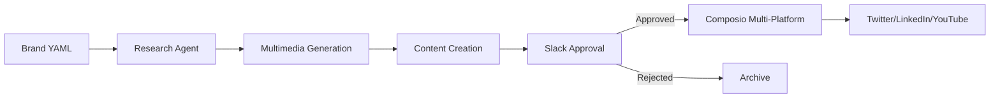

# Technical Architecture

## Overview
Brand-agnostic social media automation pipeline that discovers content, generates multimedia, and publishes across platforms with human approval workflow. Everything driven by brand YAML configuration.



## Architecture Principles

### 1. **Brand-Agnostic Design**
- Zero hardcoded content, everything from YAML
- Dynamic prompts, colors, styles from configuration
- Easy brand swapping without code changes
- Scalable to multiple brands

### 2. **Modular Architecture**
- Clean separation in `utils/` folder
- Single responsibility per module
- Easy testing and maintenance
- Independent utility development

### 3. **Multimedia-First**
- Image generation with brand colors/style
- Video generation with brand aesthetics
- Audio generation matching brand voice
- Platform-optimized media delivery

### 4. **Human-in-the-Loop**
- Interactive Slack approval with buttons
- Content preview and media links
- Approve/reject/edit workflows
- Full audit trail

## Technical Stack & Patterns
- **AI Framework**: Agno v2 + Azure OpenAI
- **Content Discovery**: Serper API for news/stories
- **Media Generation**: Replicate (images), Azure Sora (video), Sonauto (audio)
- **Social Posting**: Composio for multi-platform support
- **Approval Flow**: Slack with interactive buttons
- **Deployment**: Modal serverless platform
- **Configuration**: Brand YAML drives all behavior

## Implementation Patterns

#### Brand-Driven Pipeline
```python
# 1. Load Brand Configuration
brand_config = load_brand_config("brand/givecare.yml")

# 2. Story Discovery
research = researcher.run(f"Find news about: {topic}")

# 3. Multimedia Generation (brand-aligned)
multimedia = generate_multimedia_set(topic, platforms, brand_config)

# 4. Content Creation (brand voice)
content = creator.run(content_prompt)  # Uses brand voice/style

# 5. Approval Request (brand-specific Slack)
approved = await request_approval(content, platform, brand_config)

# 6. Multi-platform Posting
if approved:
    await post_to_platforms(content)  # Composio
```

#### Agent Configuration
```python
# Research Agent - Fast discovery
researcher = Agent(
    name="Brand Researcher",
    model="gpt-4.5-preview",
    tools=[SerpApiTools()],
    instructions=[
        f"Research content for {brand_config['name']}",
        f"Brand voice: {brand_config.get('voice_tone')}",
        "Focus on relevant stories and insights"
    ]
)

# Content Creator - Quality output
creator = Agent(
    name="Brand Content Creator",
    model="gpt-4.5-preview",
    instructions=[
        f"Create {brand_config['name']} social content",
        f"Voice: {brand_config.get('voice_tone')}",
        f"Style: {brand_config.get('voice_style')}",
        "Keep content authentic and on-brand"
    ]
)
```

## File Structure
```
social_pipeline.py      # Main pipeline (315 lines)
modal_deploy.py         # Modal deployment (95 lines)
utils/
├── multimedia_gen.py   # Media generation (362 lines)
└── slack_approval.py   # Approval workflow (293 lines)
brand/
└── givecare.yml       # Brand configuration (YAML-driven)
output/                # Generated content and media
requirements.txt       # Dependencies
```

**Total: 1,065 lines** (down from 1,819 - 41% reduction)

## Critical Technical Patterns

### Brand Configuration Driven
```yaml
# Everything derives from brand YAML
name: "GiveCare"
color_palette: "#FF9F1C, #54340E, #FFE8D6"
image_style: "soft, painterly, warm lighting"
voice_tone: "Warm, honest, and empowering"
attributes: "empathetic, clear, resourceful"

# Custom prompts (optional)
prompts:
  image_generation: "Create {image_style} image with {color_palette}..."
```

### Multimedia Pipeline
```python
# Image uses brand colors and style
generate_brand_image(topic, brand_config)

# Video uses brand mood and attributes  
generate_brand_video(topic, brand_config)

# Audio uses brand voice tone
generate_background_audio(topic, brand_config)
```

### Interactive Approval
```python
# Slack with brand-specific messaging
blocks = create_approval_blocks(content, platform, brand_config)
await slack.chat_postMessage(
    text=f"{brand_name} {platform} post approval required",
    blocks=blocks
)
```

### Platform Adaptation
- **Twitter**: Text + Image (280 char limit)
- **LinkedIn**: Text + Image (professional tone)
- **YouTube**: Text + Video + Audio (community posts)
- **Instagram**: Text + Image + Video (visual-first)
- **Facebook**: Text + Image + Video (engagement-focused)

### Error Handling & Recovery
- **Graceful degradation** if APIs fail
- **Platform-specific** error handling
- **Content archival** for all generated content
- **Approval timeout** handling
- **Dynamic naming** with actual brand names

## Component Details

### Core Pipeline (`social_pipeline.py`)
- Brand configuration loading
- Agno agent orchestration
- Platform content generation
- Result archival and reporting

### Multimedia Generation (`utils/multimedia_gen.py`)
- **Images**: Replicate with brand colors/style
- **Videos**: Azure Sora with brand aesthetics
- **Audio**: Sonauto with brand voice qualities
- **Brand-driven prompting** for all media types

### Slack Approval (`utils/slack_approval.py`)
- Interactive button workflows
- Content preview with media links
- Brand-specific messaging
- Approval status tracking

### Modal Deployment (`modal_deploy.py`)
- Serverless function deployment
- Scheduled execution (every 6 hours)
- Environment secrets management
- Health check endpoints

## Deployment Architecture

### Modal Configuration
```python
@app.function(
    image=image,
    secrets=secrets,
    timeout=1800
)
async def run_social_pipeline(topic, platforms, auto_post=False):
    pipeline = SimpleSocialPipeline()
    return await pipeline.run_pipeline(topic, platforms)
```

### Scheduling
```python
@app.function(schedule=modal.Cron("0 */6 * * *"))
async def scheduled_pipeline():
    topics = ["Brand-relevant topic rotation"]
    return await run_social_pipeline(topics[hour % len(topics)])
```

## Security & Performance

### API Key Management
- All keys in Modal secrets
- No hardcoded credentials
- Environment variable injection
- Brand-specific configurations

### Performance Characteristics
- **Pipeline execution**: ~5-10 minutes
- **Media generation**: ~2-5 minutes
- **Content creation**: ~30 seconds
- **Platform posting**: ~5 seconds each

### Cost Optimization
- Efficient model selection
- Media generation on-demand
- Caching where appropriate
- Brand-specific resource allocation

---

*Clean, modular, brand-driven architecture for scalable social media automation.*