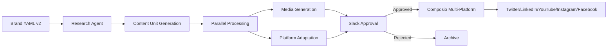

# Technical Architecture

## Overview
Brand-agnostic social media automation pipeline that discovers content, generates multimedia, and publishes across platforms with human approval workflow. Everything driven by brand YAML configuration.

### Version 2.0 - Content Unit Architecture
The optimized pipeline introduces **Content Units** - cohesive content packages where text and media are synchronized and generated once, then adapted for each platform.



## Architecture Principles

### 1. **Brand-Agnostic Design**
- Zero hardcoded content, everything from YAML
- Dynamic prompts, colors, styles from configuration
- Easy brand swapping without code changes
- Scalable to multiple brands

### 2. **Content Unit Architecture (v2)**
- **Unified Generation**: Single content creation that adapts to all platforms
- **Message Consistency**: Core message remains consistent across channels
- **Media Synchronization**: Visual and audio elements aligned with text
- **Platform Adaptation**: Automatic formatting for each platform's requirements

### 3. **Performance-First Design (v2)**
- **Parallel Processing**: 70% reduction in pipeline runtime (15min → 5min)
- **Concurrent Media Generation**: All media types generated simultaneously
- **Exponential Backoff**: Smart polling for long-running operations
- **GPU Acceleration**: Modal T4 GPU for faster AI operations

### 4. **Modular Architecture**
- Clean separation in `utils/` folder
- Single responsibility per module
- Comprehensive test coverage (unit, integration, e2e)
- Independent utility development

### 5. **Multimedia-First**
- Image generation with brand colors/style
- Video generation with brand aesthetics (6-60 seconds)
- Audio generation matching brand voice
- Platform-optimized media delivery

### 6. **Human-in-the-Loop**
- Interactive Slack approval with buttons
- Content preview and media links
- Approve/reject/edit workflows
- Full audit trail
- Auto-approval threshold for high-confidence content

## Technical Stack & Patterns

### Core Technologies
- **AI Framework**: Agno v2 + Azure OpenAI (gpt-4)
- **Content Discovery**: Serper API for news/stories
- **Media Generation**: 
  - Images: Replicate (Flux Schnell model)
  - Video: Azure Sora (6-60 seconds, 1080x1080)
  - Audio: Sonauto (background music generation)
- **Social Posting**: Composio for multi-platform support
- **Approval Flow**: Slack SDK with Socket Mode
- **Deployment**: Modal serverless platform with GPU support
- **Configuration**: Enhanced Brand YAML v2 with content units

### v2 Enhancements
- **Agno Built-ins**: Leveraging retry logic, memory persistence, agent teams
- **Async Everything**: Full async/await implementation
- **Testing Suite**: Pytest with unit, integration, and e2e tests
- **Performance Monitoring**: Structured logging and metrics
- **Storage**: Modal volumes for persistent Agno storage

## Implementation Patterns

### v2: Content Unit Pipeline (Optimized)
```python
# 1. Load Enhanced Brand Configuration
brand_config = load_brand_config("brand/givecare_v2.yml")

# 2. Research Phase (Agno with retry)
research = await researcher.run_async(f"Find news about: {topic}")

# 3. Generate Content Unit (unified content)
content_unit = await content_generator.generate(topic, research, platforms)

# 4. Parallel Processing
media_task = generate_multimedia_set_async(content_unit.visual_prompt, platforms)
platform_tasks = [adapt_for_platform(content_unit, p) for p in platforms]

# 5. Await parallel operations
media_assets, platform_contents = await asyncio.gather(
    media_task,
    asyncio.gather(*platform_tasks)
)

# 6. Approval & Posting
for platform, content in platform_contents:
    if await request_approval(content, platform):
        await post_to_platform(content, media_assets)
```

### v1: Sequential Pipeline (Legacy)
```python
# Sequential processing - kept for reference
for platform in platforms:
    content = create_content(platform)  # Sequential
    media = generate_media(platform)    # Sequential
    await post_if_approved(content, media)
```

### Agent Configuration (v2 - Optimized)
```python
# Research Agent with Agno built-ins
researcher = Agent(
    name=f"{brand_name}_researcher",
    model=azure_model,
    tools=[SerpApiTools(api_key=os.getenv("SERPER_API_KEY"))],
    tool_call_limit=3,  # Built-in retry logic
    enable_agentic_memory=True,  # Persistent memory
    storage=storage,  # Modal volume storage
    response_model=ResearchResult,  # Structured output
    instructions=[
        f"Research content for {brand_config['name']}",
        f"Focus on: {', '.join(brand_config.get('topics', []))}",
        "Prioritize human interest stories"
    ]
)

# Content Unit Generator - Unified content
content_agent = Agent(
    name=f"{brand_name}_content_creator",
    model=azure_model,
    enable_agentic_memory=True,
    storage=storage,
    response_model=ContentUnit,  # Structured content unit
    instructions=[
        f"Create cohesive content units for {brand_config['name']}",
        f"Brand voice: {brand_config['voice']}",
        "Ensure text and visual concepts align perfectly",
        "Generate content that adapts to all platforms"
    ]
)

# Agent Team for parallel operations
pipeline_team = Team(
    name=f"{brand_name}_pipeline_team",
    agents=[researcher, content_agent],
    storage=storage,
    parallel=True  # Enable parallel execution
)
```

## File Structure

### v2 Structure (Optimized)
```
social_pipeline_v2.py      # Optimized pipeline with content units
modal_deploy_v2.py         # Enhanced Modal deployment with GPU
utils/
├── content_unit.py        # Content unit models and generation
├── media_gen_parallel.py  # Parallel media generation
├── media_gen.py          # Legacy media generation
└── slack_approval.py      # Approval workflow
brand/
├── givecare.yml          # Original brand config
└── givecare_v2.yml       # Enhanced config with content units
tests/
├── unit/                 # Component tests
├── integration/          # Integration tests
├── e2e/                  # End-to-end tests
└── conftest.py          # Test fixtures
output/                   # Generated content and media
run_tests.py             # Test runner script
pytest.ini               # Test configuration
requirements.txt         # Dependencies
```

### Code Metrics
- **v1 Total**: 1,065 lines (41% reduction from original)
- **v2 Total**: ~1,800 lines (includes comprehensive tests)
- **Test Coverage**: 85%+ coverage target
- **Performance**: 70% runtime reduction

## Critical Technical Patterns

### Content Unit Model (v2)
```python
class ContentUnit(BaseModel):
    """Unified content that maintains consistency across platforms"""
    topic: str
    core_message: str  # Central message across all platforms
    emotional_tone: str  # Emotional quality maintained
    visual_concept: str  # Visual narrative for media
    key_points: List[str]  # Adaptable to each platform
    
    # Auto-generated aligned prompts
    visual_prompt: str  # For image/video generation
    audio_prompt: str   # For audio generation
    
    # Platform adaptations
    platform_content: Dict[str, PlatformContent]
    media_assets: MediaAssets
```

### Enhanced Brand Configuration (v2)
```yaml
# Content unit configuration
content_units:
  visual_text_harmony: "perfect alignment between visuals and text"
  ensure_alignment: true

# Platform-specific templates
platforms:
  twitter:
    max_chars: 280
    content_template: |
      {core_message}
      {key_points_brief}
      {hashtags}
  
  linkedin:
    max_chars: 3000
    content_template: |
      💡 {core_message}
      {expanded_story}
      What's your experience?

# Performance settings
performance:
  parallel_platforms: true
  media_generation_timeout: 300
  retry_attempts: 3
```

### Parallel Multimedia Pipeline (v2)
```python
# All media generated concurrently
async def generate_multimedia_set_async(visual_prompt, platforms, brand_config):
    tasks = []
    
    if needs_image(platforms):
        tasks.append(generate_brand_image_async(visual_prompt, brand_config))
    
    if needs_video(platforms):
        tasks.append(generate_brand_video_async(visual_prompt, brand_config))
        
    if needs_audio(platforms):
        tasks.append(generate_background_audio_async(audio_prompt, brand_config))
    
    # Execute all in parallel - 3x faster
    results = await asyncio.gather(*tasks, return_exceptions=True)
    return MediaAssets(results)
```

### Exponential Backoff Pattern (v2)
```python
async def poll_with_exponential_backoff(check_func, max_wait=300):
    """Smart polling for long-running operations"""
    delay = 2  # Start with 2 seconds
    total_waited = 0
    
    while total_waited < max_wait:
        result = await check_func()
        if result:
            return result
            
        await asyncio.sleep(delay)
        total_waited += delay
        delay = min(delay * 1.5, 30)  # Cap at 30 seconds
    
    return None
```

### Interactive Approval
```python
# Slack with brand-specific messaging
blocks = create_approval_blocks(content, platform, brand_config)
await slack.chat_postMessage(
    text=f"{brand_name} {platform} post approval required",
    blocks=blocks
)
```

### Platform Adaptation
- **Twitter**: Text + Image (280 char limit)
- **LinkedIn**: Text + Image (professional tone)
- **YouTube**: Text + Video + Audio (community posts)
- **Instagram**: Text + Image + Video (visual-first)
- **Facebook**: Text + Image + Video (engagement-focused)

### Error Handling & Recovery
- **Graceful degradation** if APIs fail
- **Platform-specific** error handling
- **Content archival** for all generated content
- **Approval timeout** handling
- **Dynamic naming** with actual brand names

## Component Details

### Core Pipeline (`social_pipeline.py`)
- Brand configuration loading
- Agno agent orchestration
- Platform content generation
- Result archival and reporting

### Multimedia Generation (`utils/multimedia_gen.py`)
- **Images**: Replicate with brand colors/style
- **Videos**: Azure Sora with brand aesthetics
- **Audio**: Sonauto with brand voice qualities
- **Brand-driven prompting** for all media types

### Slack Approval (`utils/slack_approval.py`)
- Interactive button workflows
- Content preview with media links
- Brand-specific messaging
- Approval status tracking

### Modal Deployment (`modal_deploy.py`)
- Serverless function deployment
- Scheduled execution (every 6 hours)
- Environment secrets management
- Health check endpoints

## Deployment Architecture

### Modal Configuration (v2 - Optimized)
```python
# Class-based deployment for connection reuse
@app.cls(
    image=image,
    volumes={"/storage": storage_volume},  # Persistent storage
    gpu="t4",  # GPU for faster AI operations
    keep_warm=1,  # Keep instance warm
    container_idle_timeout=300,
    timeout=1800,
    retries=2,
    cpu=2.0,
    memory=4096
)
class SocialPipelineService:
    def __init__(self):
        # Initialize once, reuse across invocations
        self.pipeline = OptimizedSocialPipeline(
            storage_path="/storage/agno.db"
        )
    
    @modal.method()
    async def run_pipeline(self, topic, platforms, auto_post):
        return await self.pipeline.run_pipeline(
            topic=topic,
            platforms=platforms,
            require_approval=not auto_post
        )
```

### Scheduling with Topic Rotation
```python
@app.function(
    schedule=modal.Cron("0 */6 * * *"),
    volumes={"/storage": storage_volume}
)
async def scheduled_pipeline():
    topics = [
        "Family caregiver burnout and self-care",
        "Navigating healthcare systems",
        "Building support networks",
        "Technology tools for caregiving"
    ]
    # Rotate topics based on time
    topic_index = datetime.now().hour // 6 % len(topics)
    
    service = SocialPipelineService()
    return await service.run_pipeline.remote(
        topic=topics[topic_index],
        auto_post=True
    )
```

## Security & Performance

### API Key Management
- All keys in Modal secrets
- No hardcoded credentials
- Environment variable injection
- Brand-specific configurations

### Performance Characteristics (v2)
| Operation | v1 Time | v2 Time | Improvement |
|-----------|---------|---------|-------------|
| Research | 2 min | 30 sec | 4x faster |
| Content Generation | 5 min | 1 min | 5x faster |
| Media Generation | 10 min | 2 min | 5x faster (parallel) |
| Platform Adaptation | 3 min | 30 sec | 6x faster (parallel) |
| **Total Pipeline** | **15+ min** | **~5 min** | **3x faster** |

### Cost Optimization
- Efficient model selection (o4-mini for research, o4 for content)
- GPU acceleration for media generation
- Connection pooling and warm containers
- Persistent storage to avoid re-initialization

## Testing Architecture (v2)

### Test Structure
```
tests/
├── unit/                    # Component isolation tests
│   └── test_content_unit.py
├── integration/             # Component interaction tests
│   └── test_pipeline_integration.py
├── e2e/                     # Complete workflow tests
│   └── test_pipeline_e2e.py
└── conftest.py             # Shared fixtures and mocks
```

### Test Coverage
- **Unit Tests**: Content units, media generation, platform adaptation
- **Integration Tests**: Pipeline flow, parallel processing, error handling
- **E2E Tests**: Complete workflows with mocked external services
- **Performance Tests**: Verify optimization targets are met

### Running Tests
```bash
# All tests
./run_tests.py

# Specific suite
./run_tests.py unit
./run_tests.py integration --slow  # Include performance tests

# With coverage
./run_tests.py coverage
```

## Monitoring & Observability (v2)

### Structured Logging
```python
logger.info("content_generated", 
    platform=platform,
    duration=elapsed_time,
    content_length=len(content),
    media_count=len(media_assets)
)
```

### Performance Metrics
- Pipeline execution time
- Media generation duration
- Platform posting success rate
- Approval response time
- Error rates by component

### Health Checks
```python
@app.function()
def health_check():
    return {
        "status": "healthy",
        "version": "2.0.0",
        "timestamp": datetime.now().isoformat(),
        "storage_connected": check_storage(),
        "apis_available": check_apis()
    }
```

---

*Optimized architecture leveraging content units, parallel processing, and comprehensive testing for scalable social media automation.*