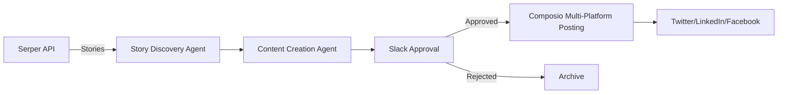

# Agent Social - Technical Architecture

## System Overview

Agent Social is an automated content pipeline that discovers news, generates brand-aligned social media content, and posts to multiple platforms with human approval.



## Architecture Principles

### 1. **Single-File Monolith**
- All components in `social_pipeline.py` (~650 lines)
- Simplifies Modal deployment and debugging
- No complex import chains or module dependencies
- Easy to understand full system flow

### 2. **Brand-Driven Design**
- YAML configuration defines brand voice
- All content generation uses brand framework
- Easy to add new brands without code changes
- Version control for brand evolution

### 3. **Human-in-the-Loop**
- Mandatory approval before posting
- Slack integration for quick reviews
- 30-minute timeout for decisions
- Full audit trail of approvals

### 4. **Serverless Execution**
- Modal platform for zero infrastructure
- Scheduled runs every 6 hours
- Auto-scaling based on load
- Built-in secrets management

## Component Architecture

### Core Pipeline Components

```python
# 1. Story Discovery
class StoryDiscoveryAgent:
    - Searches for relevant news via Serper API
    - Filters by brand topics
    - Returns structured story data
    
# 2. Content Generation  
class ContentCreationAgent:
    - Takes story + brand framework
    - Generates platform-specific content
    - Includes visual prompts
    - Ensures brand voice consistency

# 3. Approval System
class SlackApprovalBot:
    - Posts content for review
    - Interactive approve/reject buttons
    - Timeout handling (30 min)
    - Socket Mode for reliability

# 4. Publishing System
class ComposioPublisher:
    - Multi-platform posting
    - Platform-specific formatting
    - Error handling per platform
    - Success/failure reporting
```

### Data Flow

1. **Input**: Scheduled trigger or manual webhook
2. **Discovery**: Serper API finds 5-10 relevant stories
3. **Selection**: Agent picks most engaging story
4. **Generation**: Creates content with brand voice
5. **Review**: Slack notification with preview
6. **Decision**: Human approves/rejects
7. **Publishing**: Posts to all platforms
8. **Archive**: Saves to output/ directory

## Technology Stack

### Core Technologies
- **Python 3.11**: Async/await support
- **Agno Framework**: Agent orchestration
- **Azure OpenAI**: LLM capabilities
- **Modal**: Serverless deployment
- **Composio**: Social media APIs

### APIs & Services
- **Serper**: News/story discovery
- **Slack**: Approval workflow
- **Twitter/LinkedIn**: Publishing targets
- **GitHub Actions**: CI/CD pipeline

### Models & Agents
```python
# Discovery Agent - Fast iteration
model="o4-mini"

# Content Agent - Quality output  
model="o4"

# Both use structured outputs via Pydantic
```

## Deployment Architecture

### Modal Configuration
```python
@app.function(
    secrets=[Secret.from_name("agent-social-secrets")],
    memory=1024,
    timeout=600
)
async def social_pipeline():
    # Main pipeline execution
```

### Scheduling
```python
@app.schedule("0 */6 * * *")  # Every 6 hours
async def scheduled_social_pipeline():
    await social_pipeline()
```

### Web Endpoints
```python
@app.web_endpoint(method="GET")
async def health_check():
    return {"status": "healthy"}

@app.web_endpoint(method="POST")  
async def trigger_pipeline():
    # Manual trigger endpoint
```

## Security Architecture

### API Key Management
- All keys stored in Modal secrets
- No keys in codebase
- Environment variable injection
- Rotation reminders via CI/CD

### Access Control
- Slack approval from authorized users
- Modal deployment restricted
- GitHub branch protection
- API rate limiting respect

## Database Schema

Currently file-based storage in `output/` directory:

```
output/
├── 2024-01-15_story_001.json      # Story data
├── 2024-01-15_content_001.json    # Generated content
├── 2024-01-15_approval_001.json   # Approval decision
└── 2024-01-15_results_001.json    # Posting results
```

Future: PostgreSQL for analytics and history.

## Error Handling Strategy

### Graceful Degradation
```python
try:
    stories = await discover_stories()
except SerperAPIError:
    # Use cached stories
    stories = load_cached_stories()
```

### Platform-Specific Handling
```python
results = []
for platform in platforms:
    try:
        result = await post_to_platform(platform, content)
        results.append(result)
    except PlatformError as e:
        log_error(f"{platform} failed: {e}")
        continue
```

### Timeout Management
- Story discovery: 30 seconds
- Content generation: 60 seconds
- Approval wait: 30 minutes
- Platform posting: 30 seconds each

## Monitoring & Observability

### Logging
- Structured logging throughout pipeline
- Modal logs for production debugging
- Error aggregation in Slack
- Success metrics tracking

### Alerts
- Pipeline failure notifications
- Approval timeout warnings
- API rate limit alerts
- Platform posting failures

### Metrics (Planned)
- Pipeline success rate
- Content approval rate
- Platform engagement rates
- API usage costs

## Performance Characteristics

### Latency
- Full pipeline: ~3-5 minutes
- Story discovery: ~5-10 seconds
- Content generation: ~15-30 seconds
- Platform posting: ~5 seconds each

### Scalability
- Modal auto-scales with load
- Stateless design enables parallelism
- API rate limits are bottleneck
- Can handle multiple brands concurrently

### Cost Optimization
- O4-mini for discovery (cheaper)
- O4 for content (quality priority)
- Story caching reduces API calls
- Batch processing where possible

## Integration Points

### Inbound
- Modal cron scheduler
- Manual webhook triggers
- Future: Content calendar API

### Outbound  
- Serper API (discovery)
- Slack API (approvals)
- Composio API (posting)
- Future: Analytics platforms

## Disaster Recovery

### Failure Modes
1. **API Outage**: Use cached content
2. **Approval Timeout**: Skip posting
3. **Platform Failure**: Retry later
4. **Modal Outage**: Manual execution

### Backup Strategies
- All content archived locally
- API keys in multiple locations
- Manual posting fallback
- Alternative scheduling options

## Future Architecture Considerations

### Microservices Migration
When to split the monolith:
- Over 1000 lines of code
- Multiple team ownership
- Different scaling needs
- Complex testing requirements

### Database Addition
PostgreSQL for:
- Content history
- Analytics data
- Approval audit trail
- Performance metrics

### Multi-Brand Architecture
```
brands/
├── givecare.yaml
├── brand2.yaml
└── brand3.yaml

# Dynamic brand loading
brand = load_brand(brand_name)
pipeline = create_pipeline(brand)
```

### Enhanced Observability
- OpenTelemetry integration
- Distributed tracing
- Custom dashboards
- Cost tracking per brand

---

*Architecture designed for simplicity, reliability, and brand consistency.*