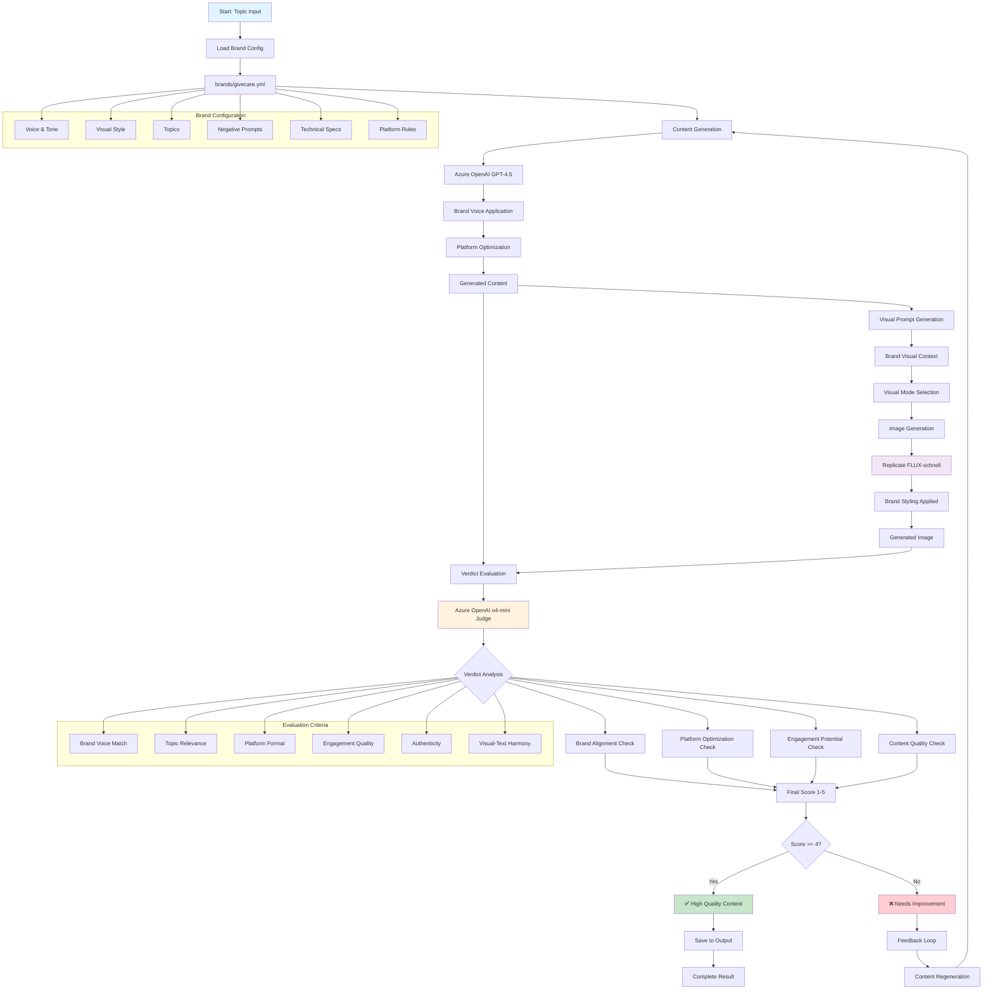

# Brand-Aware Content Generation & Evaluation Pipeline

## Pipeline Components Breakdown

### 1. **Input Layer**
- Topic selection
- Platform targeting (Twitter, LinkedIn, etc.)
- Brand configuration loading

### 2. **Content Generation Layer**
- Azure OpenAI GPT-4.5 for text generation
- Brand voice application from YAML config
- Platform-specific optimization
- Hashtag generation

### 3. **Visual Generation Layer**
- Brand-aware visual prompt creation
- Visual mode selection (framed_portrait, lifestyle_scene, illustrative_concept)
- Replicate FLUX image generation
- Brand styling application (colors, borders, composition)

### 4. **Evaluation Layer**
- Verdict AI framework with Azure OpenAI o4-mini
- Multi-criteria assessment:
  - Brand alignment scoring
  - Platform optimization check
  - Engagement potential analysis
  - Content quality evaluation

### 5. **Quality Control Layer**
- Intelligent feedback loop
- Content regeneration for low scores
- Human-in-the-loop approval
- Output archival

### 6. **Brand Configuration System**
- Voice & tone guidelines
- Visual style specifications
- Topic focus areas
- Negative prompt lists
- Technical specifications
- Platform-specific rules

## Key Features

- **Brand-Agnostic Architecture**: All styling from YAML configuration
- **AI-Powered Evaluation**: Real LLM judging with Verdict framework
- **Multi-Modal Generation**: Text + visual content creation
- **Quality Feedback Loops**: Automatic improvement cycles
- **Platform Optimization**: Twitter vs LinkedIn adaptation
- **Scalable Design**: Works with any brand configuration